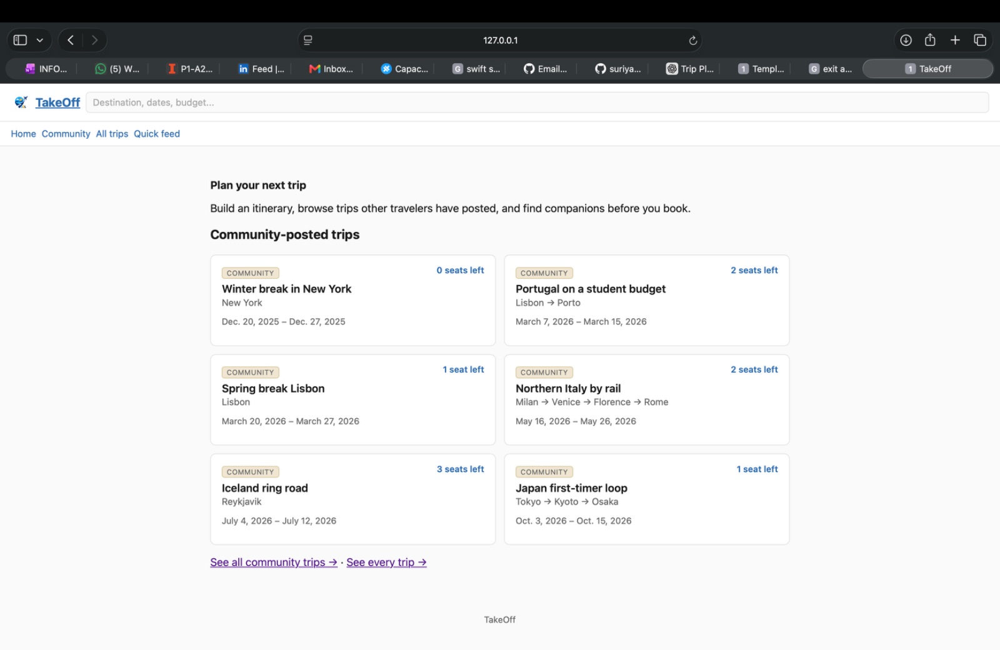
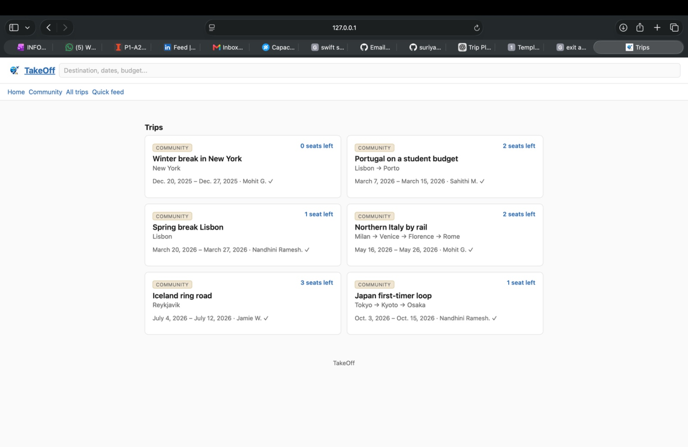
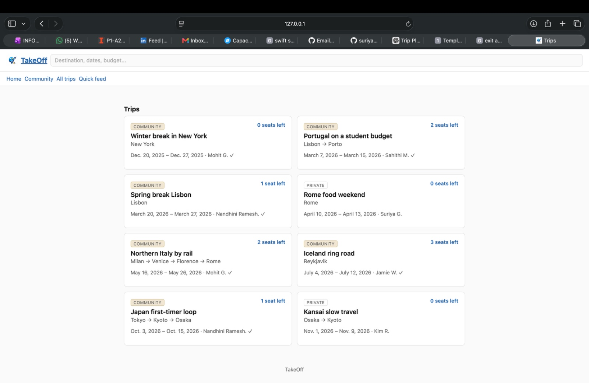
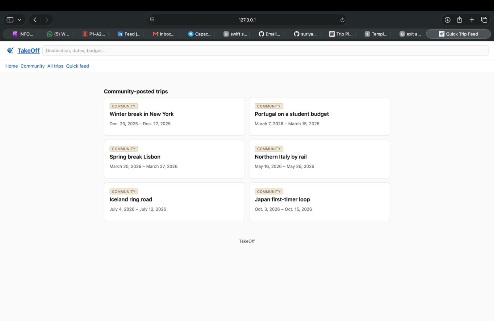
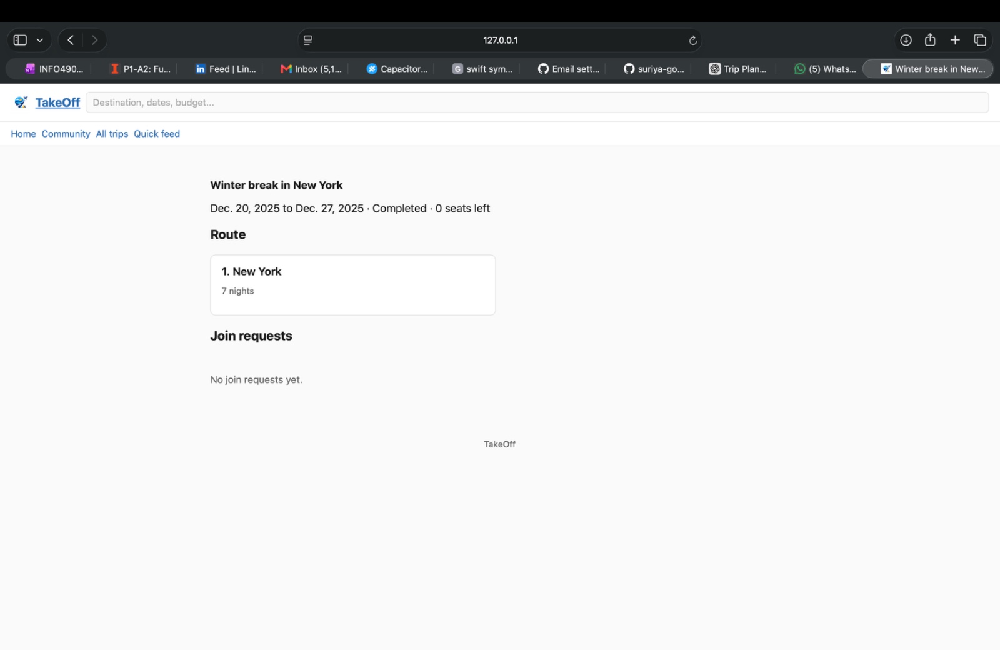
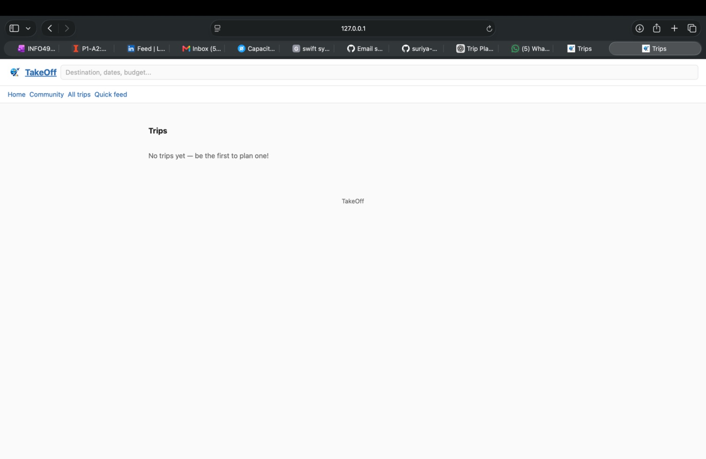

# TakeOff

A community-driven trip planning app built with Django. Users build a
multi-city itinerary, follow booking links out to third-party sites, and
optionally post the trip publicly so other travelers can ask to join.

---

## Naming

| Name | What it is | Why this name |
|---|---|---|
| `takeoff` | Django project (settings/URL container) | The product is a trip planner whose differentiator is finding trip *mates*. The project name names the product as a whole. |
| `trips` | Django app | The app owns one domain: a trip and everything hanging off it (route, itinerary items, join requests). |

---

## Features

- **Trip planning** — a trip is an ordered sequence of city stays
  (`TripStop`), each holding its own transport, hotel, activity, food and
  rental items (`ItineraryItem`).
- **Public/private trips** — a trip can stay private or be posted publicly
  so other travelers can request to join.
- **Community matching** — `JoinRequest` tracks pending/accepted/declined
  requests from other travelers to join a public trip.
- **Verified travelers** — accounts signing up with a `.edu` / company
  domain get a verified badge, so strangers feel comfortable joining each
  other's trips.
- **Django admin** — full CRUD over every model out of the box.

---

## Screenshots

**Home**


**Community trips**


**All trips**


**Quick feed**


**Trip detail**


**Empty state**


---

## Project structure

```
takeoff/
  settings/
    base.py             # shared: INSTALLED_APPS, MIDDLEWARE, TEMPLATES, etc.
    development.py       # DEBUG = True, sqlite
    production.py        # DEBUG = False, DATABASE_URL / ALLOWED_HOSTS from env
  secrets_environment.py    # loads .env via django-environ
  urls.py
trips/
  models.py              # Destination, Traveler, Trip, TripStop, ItineraryItem, JoinRequest
  views.py                # home page + trip views (FBV and CBV)
  urls.py
  static/trips/img/logo.png
templates/
  trips/
    base.html             # header (logo + "TakeOff"), nav, , footer
    home.html
    trip_list.html
    trip_list_manual.html
    trip_detail.html
docs/
  wireframes/             # product wireframe deck
  notes/notes.txt          # running project notes
  screenshots/             # app screenshots used in this README
ER_Diagram/
  er_diagram.pdf
  er_diagram_chen.png
DESIGN_NOTES.md            # schema/design rationale
seed_data.py
```

---

## Views

| URL | View | Type |
|---|---|---|
| `/` | `home()` | FBV — landing page, preview of public community trips |
| `/trips/manual/` | `trip_manual_view` | FBV — manual `HttpResponse` via `loader.get_template()` |
| `/trips/` | `trip_list_view` | FBV — `render()` shortcut |
| `/trips/<pk>/` | `TripDetailView` | CBV — base `django.views.View` |
| `/trips/generic/` | `TripListView` | CBV — generic `ListView`, filtered to public trips |
| `/admin/` | — | Django Admin |

`trip_list.html` is shared between the `render()` FBV and the generic
`ListView` — same template, two different ways of producing its context.

---

## Running it

```bash
git clone git@github.com:suriya-gopal/1_takeoff.git
cd 1_takeoff

python -m venv .venv && source .venv/bin/activate     # Windows: .venv\Scripts\activate
pip install -r requirements.txt

echo "SECRET_KEY=your-secret-key-here" > .env   # any random string works for local dev

python manage.py migrate
python manage.py runserver
```

`db.sqlite3` ships with seeded data, so `migrate` + `runserver` is enough to
see the app working.

### Admin logins

| Username | Password |
|---|---|
| `mohitg2` | `uiuc12345` |
| `tester` | `uiuc12345` |

### Re-seeding from scratch

```bash
python manage.py shell < seed_data.py
```

Wipes the app tables, reloads all test data, then prints a constraint /
`on_delete` validation report.

### Running the automated tests

```bash
python manage.py test trips
```

---

## Configuration

Secrets (`SECRET_KEY`, any API keys) live in `.env` at the project root,
loaded through `takeoff/secrets_environment.py` via django-environ. `.env`
is gitignored. Nothing secret should ever land in `base.py`,
`development.py`, `production.py`, or git history.

---
