# TakeOff

A community-driven trip planning app built with Django. Users build a
multi-city itinerary, follow booking links out to third-party sites, and
optionally post the trip publicly so other travelers can ask to join.

---

## Naming

| Name | What it is | Why this name |
|---|---|---|
| `takeoff` | Django project (settings/URL container) | The product is a trip planner whose differentiator is finding trip *mates*. The project name names the product as a whole. |
| `trips` | Django app | The app owns one domain: a trip and everything hanging off it (route, itinerary items, join requests). |

---

## Features

- **Trip planning** — a trip is an ordered sequence of city stays
  (`TripStop`), each holding its own transport, hotel, activity, food and
  rental items (`ItineraryItem`).
- **Public/private trips** — a trip can stay private or be posted publicly
  so other travelers can request to join.
- **Community matching** — `JoinRequest` tracks pending/accepted/declined
  requests from other travelers to join a public trip.
- **Verified travelers** — accounts signing up with a `.edu` / company
  domain get a verified badge, so strangers feel comfortable joining each
  other's trips.
- **Insights** — interactive Vega-Lite charts fed by JSON endpoints.
- **Trip budget in local currency** — live exchange rates for any public trip.
- **Reports and exports** — community totals plus CSV and JSON downloads.
- **Django admin** — full CRUD over every model out of the box.

---

## Screenshots

**Home** — community trips and popular destinations
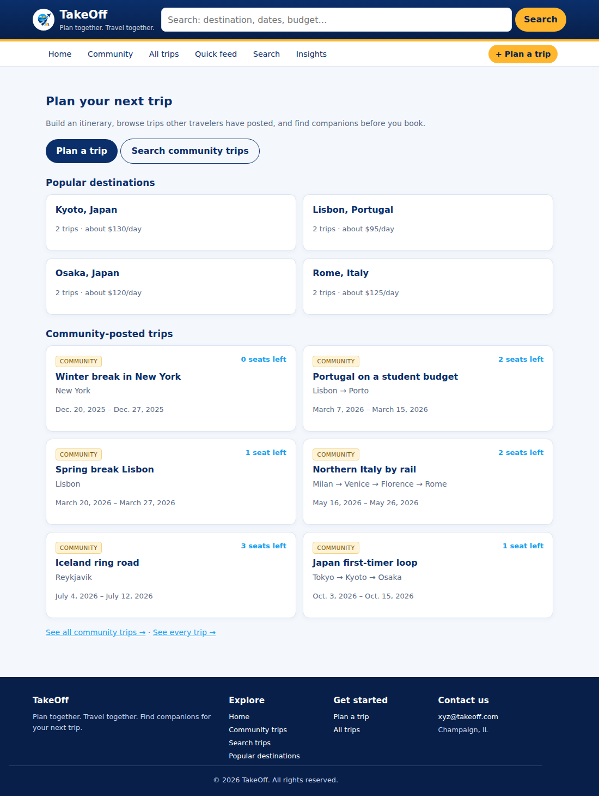

**Navigation bar** — every link is built with ``
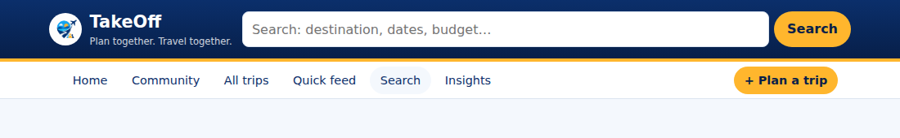

**Trip detail** — opened from a trip card
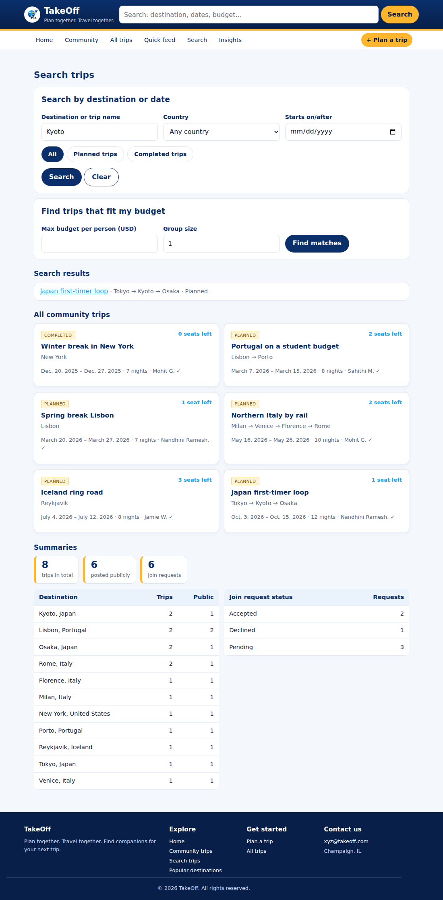

**Search** — forms and results at the top
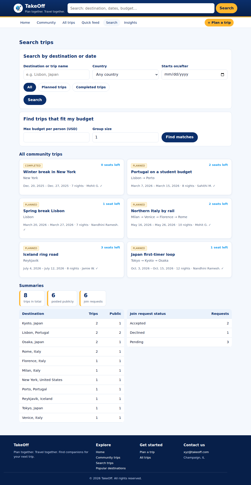
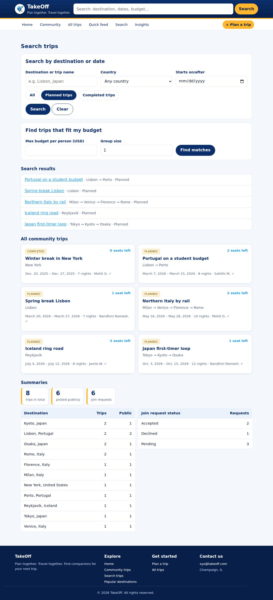
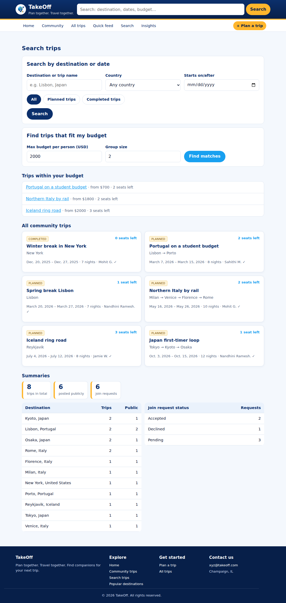

**Styling** — custom CSS applied
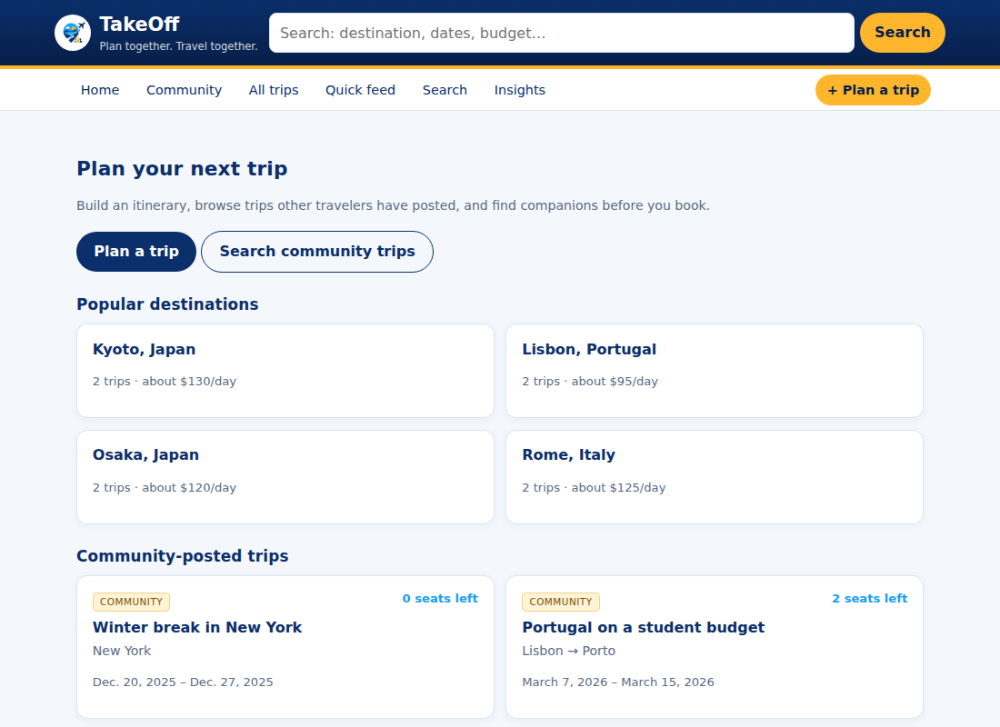

**Chart** — trips per destination
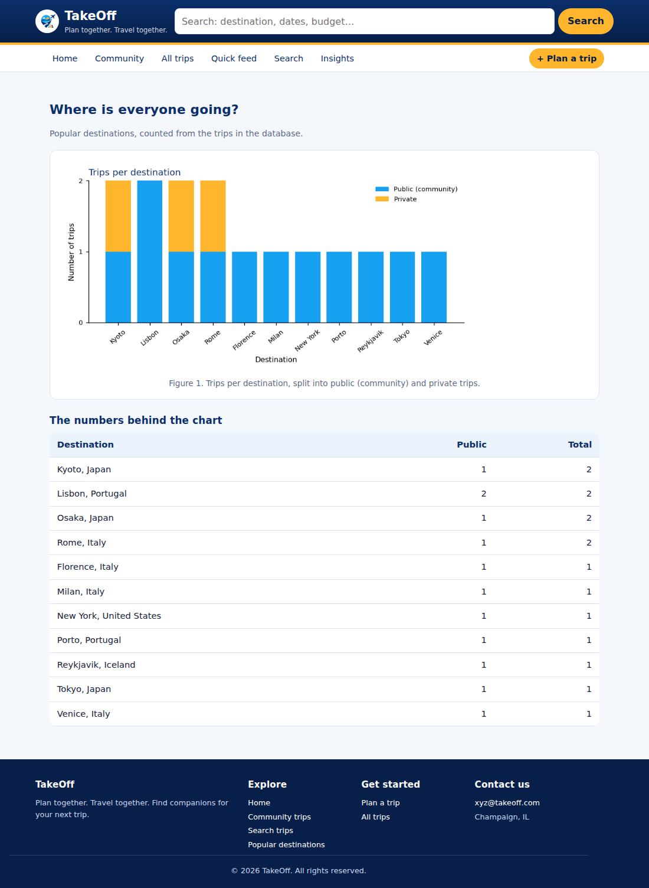

**Plan a trip** — validation and a saved trip
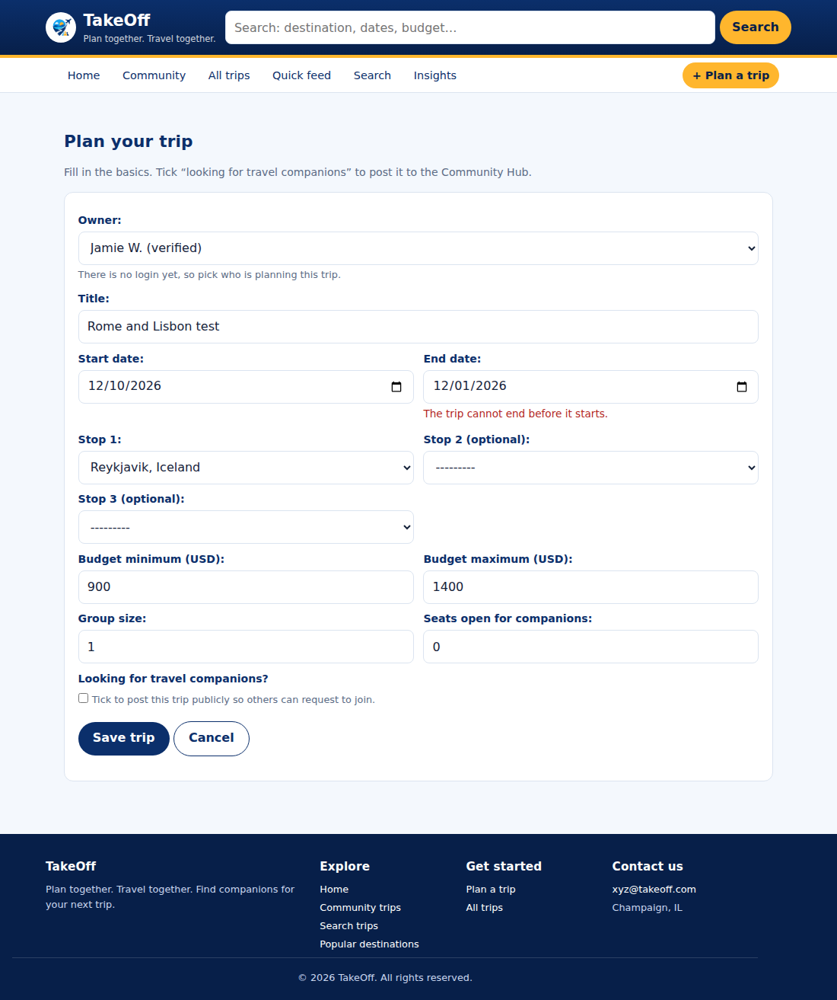
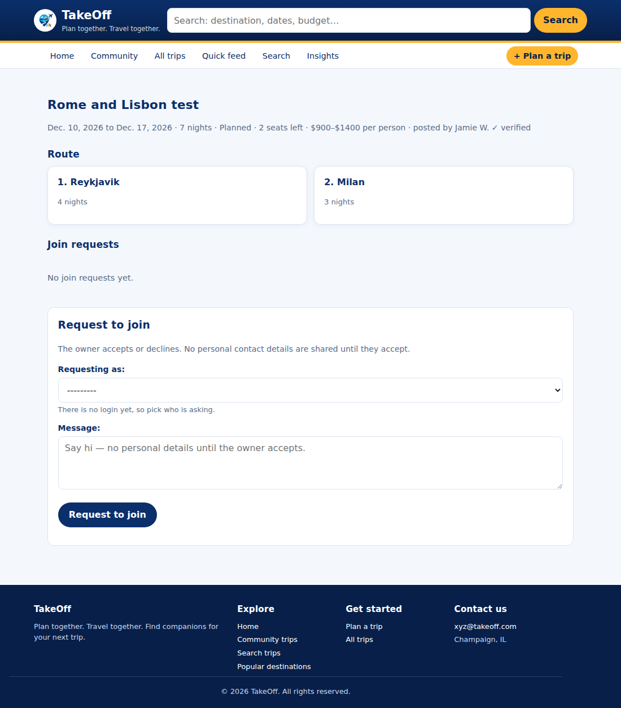

**Request to join**
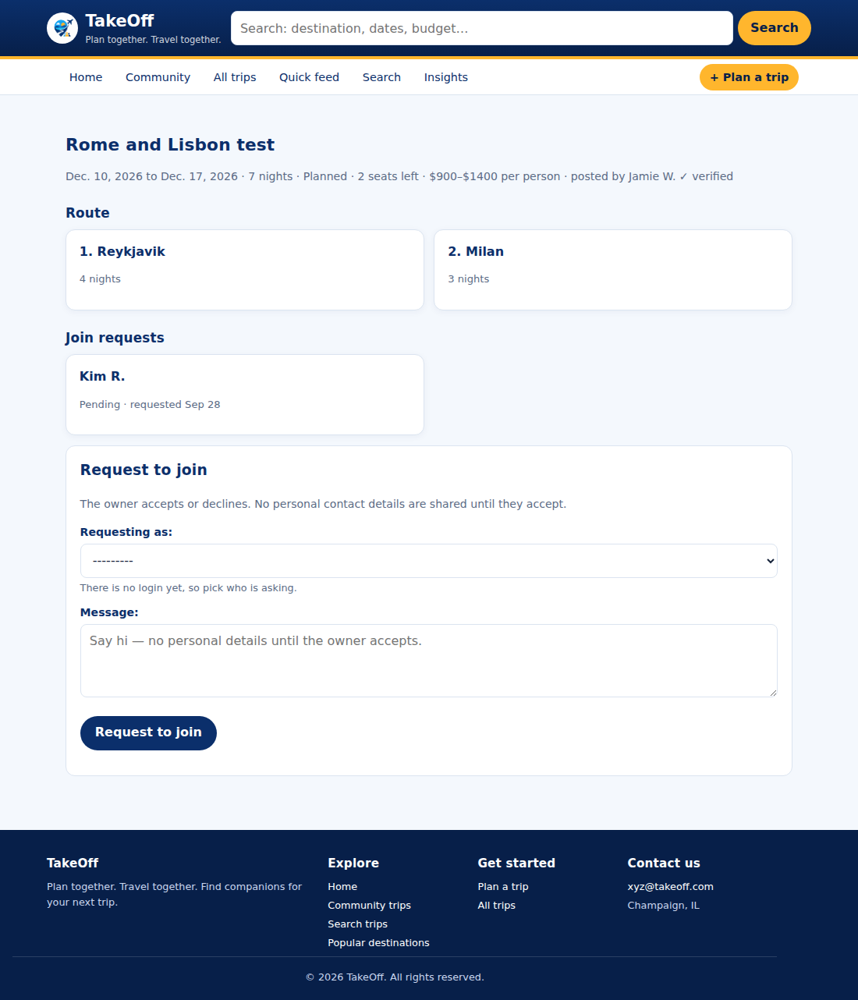

**JSON API**
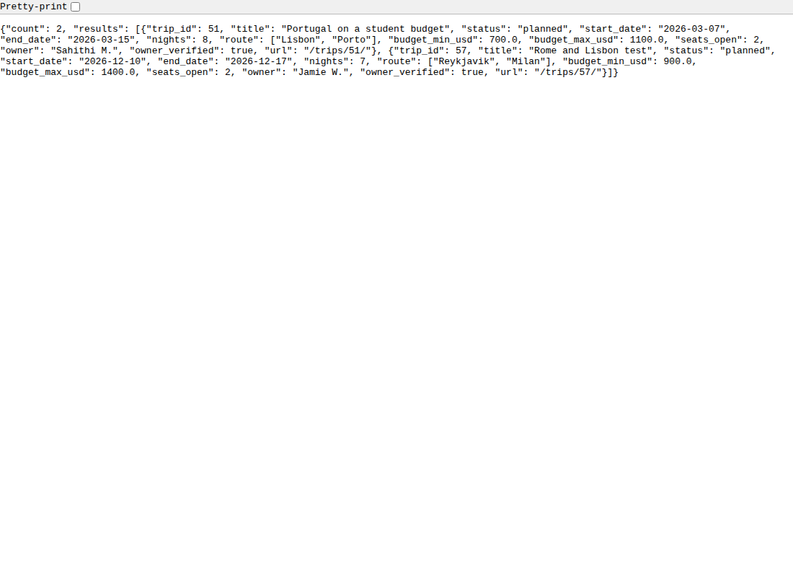

**Footer** — desktop and mobile

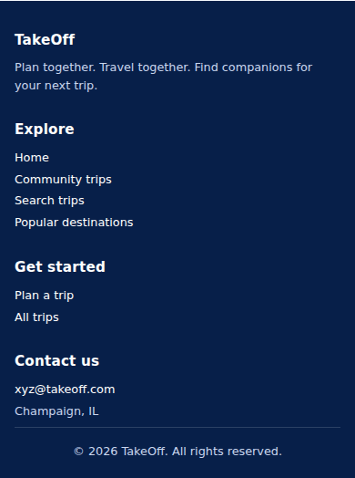

---

## Project structure

```
takeoff/
  ui-ux/static/css/    # normalize.css + style.css
  settings/
    base.py             # shared: INSTALLED_APPS, MIDDLEWARE, TEMPLATES, etc.
    development.py       # DEBUG = True, sqlite
    production.py        # DEBUG = False, DATABASE_URL / ALLOWED_HOSTS from env
  secrets_environment.py    # loads .env via django-environ
  urls.py
trips/
  forms.py               # TripForm (plan a trip), JoinRequestForm (request to join)
  models.py              # Destination, Traveler, Trip, TripStop, ItineraryItem, JoinRequest
  views.py                # pages, search, forms, PNG chart, JSON API (FBV and CBV)
  charts.py               # chart feeds, Vega-Lite specs, insights page
  budget.py               # exchange-rate lookup and trip budget views
  exports.py              # CSV / JSON downloads
  reports.py              # community report page
  urls.py
  static/trips/img/logo.png
  static/trips/js/insights.js
templates/
  trips/
    base.html             # header (logo + "TakeOff"), nav, , footer
    home.html
    trip_list.html
    trip_list_manual.html
    trip_detail.html
    trip_search.html      # search forms, results, summaries
    trip_form.html        # plan a trip
    insights.html         # interactive charts
    trip_budget.html      # budget in local currency
    reports.html          # report tables and downloads
  404.html, 500.html
docs/
  wireframes/             # product wireframe deck
  notes/notes.txt          # running project notes
  charts/                 # Vega-Lite specifications
  screenshots/             # app screenshots used in this README
ER_Diagram/
  er_diagram.pdf
  er_diagram_chen.png
DESIGN_NOTES.md            # schema/design rationale
seed_data.py
```

---

## Views

| URL | View | Type |
|---|---|---|
| `/` | `home()` | FBV — landing page, preview of public community trips |
| `/trips/manual/` | `trip_manual_view` | FBV — manual `HttpResponse` via `loader.get_template()` |
| `/trips/` | `trip_list_view` | FBV — `render()` shortcut |
| `/trips/<pk>/` | `TripDetailView` | CBV — base `django.views.View` |
| `/trips/generic/` | `TripListView` | CBV — generic `ListView`, filtered to public trips |
| `/trips/search/` | `TripSearchView` | CBV — `ListView` that handles both the filter search and the budget search |
| `/trips/new/` | `TripCreateView` | CBV — `CreateView` for the "Plan your trip" form |
| `/insights/` | `charts.insights_page` | FBV — interactive charts |
| `/insights/specs/destinations.json`, `/insights/specs/departures.json` | `charts.destination_chart_json`, `charts.departure_chart_json` | FBV — Vega-Lite specifications |
| `/trips/<pk>/budget/` | `budget.trip_budget_page` | FBV — trip budget in a chosen currency |
| `/reports/` | `reports.ReportsView` | CBV — community totals and downloads |
| `/export/trips.csv`, `/export/trips.json` | `exports.export_trips_csv`, `exports.export_trips_json` | FBV — file downloads |
| `/charts/trips-by-destination.png` | `trips_by_destination_chart()` | FBV — Matplotlib PNG |
| `/api/…` | see “JSON API” below | FBV + CBV JSON endpoints |
| `/admin/` | — | Django Admin |

`trip_list.html` is shared between the `render()` FBV and the generic
`ListView` — same template, two different ways of producing its context.

---

## Navigation and links

`/` is the home page. The header search and nav bar use `` only (no
hard-coded paths). `Trip.get_absolute_url()` builds every link to a trip detail
page (`/trips/<pk>/`), so templates write `{{ trip.get_absolute_url }}`.

## Search (`/trips/search/`)

Two forms sit at the top of the page, with their results directly below.
The filter form searches public trips by destination, country, start date and
Planned/Completed tab; its choices go in the URL, so a search link can be shared.
The budget form finds open trips within a budget and group size and keeps the
budget out of the URL. Below the results are the full list of community trips
and summaries (totals, trips per destination, join requests per status).

## Styling

`takeoff/ui-ux/static/css/` holds `normalize.css` and the TakeOff `style.css`
(logo colours, header, cards, forms). Cache busting: `ManifestStaticFilesStorage` (hashed file names) in production.

Static files are served by Django in development and by the host's static
mapping in production (see Deployment).

**Footer** (`base.html`, styled by `.footer-grid` in `style.css`): four columns —
a TakeOff blurb, Explore links, Get started links and Contact us (placeholder
address `xyz@takeoff.com`, Champaign, IL) — above a copyright line whose year
comes from ``. The columns collapse to one on narrow screens. The
normalize.css MIT licence stays in that file's header comment.

## Charts (`/insights/`)

Two Vega-Lite v5 charts rendered in the browser with vega-embed:

- **Public trips by destination** — bar chart, coloured by country.
- **Departures by month** — line chart of public trips and open seats.

Each chart loads its data from a JSON feed (`/api/insights/destinations/`,
`/api/insights/departures/`) and its specification from
`/insights/specs/…json`, so the same feeds can be opened in the Vega editor
(CORS is enabled for `https://vega.github.io` on `/api/` only). Saved specifications
for local use are in `docs/charts/`. The original Matplotlib PNG remains at
`/charts/trips-by-destination.png` and is the fallback when scripts are blocked.

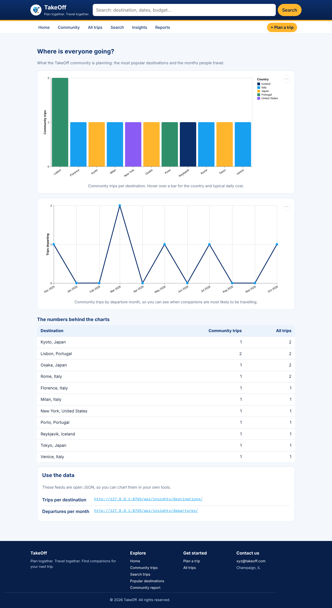
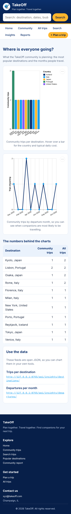

## Trip budget in local currency

`/trips/<pk>/budget/` converts a trip's budget range with the daily
exchange rates from [Frankfurter](https://frankfurter.dev) (no API key). The
call lives in `trips/budget.py` with a 5-second timeout. The JSON version is
`/api/trips/<pk>/budget/?currency=EUR`; failures come back as JSON with a
`400` (unsupported currency), `404` (not a public trip), `502` (rate service
problem) or `504` (rate service timeout). Rates are fetched per request and not stored.

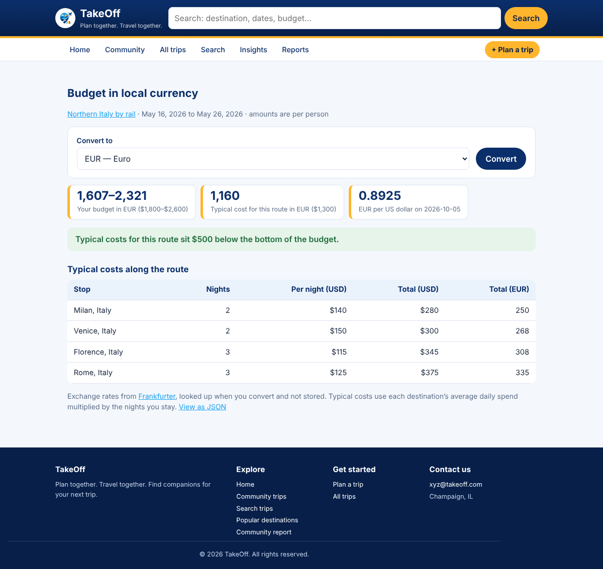

## Reports and exports

`/reports/` lists trips per destination, trips per status and join requests
per status, using database aggregations on public trips. The page links to
`/export/trips.csv` and `/export/trips.json`; both download with a timestamped
file name, and the CSV neutralises cells that begin with `=`, `+`, `-` or `@`
so spreadsheets don't run them as formulas.

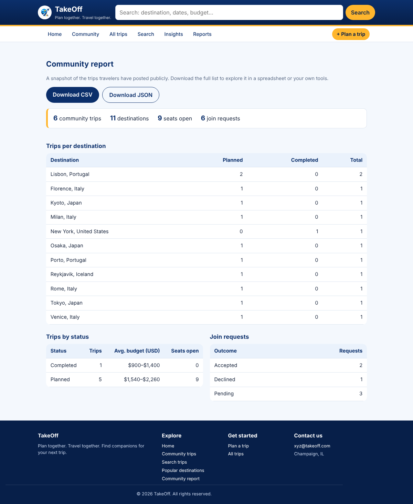

## Forms

- **Plan your trip** (`/trips/new/`): dates, budget range, group size, up to
  three ordered stops and a "looking for travel companions" checkbox. Ticking it
  posts the trip publicly. Includes `` and friendly validation errors.
- **Request to join** (on each open public trip page): creates a join request.
- There is no login yet, so both forms ask who is acting from a dropdown.

## JSON API

Read-only, and only **public** trips are ever returned. Filters go in the
query string; a bad filter value returns a JSON `400` error.

| Endpoint | View | Filters |
|---|---|---|
| `/api/trips/` | function view `api_trips` | `q`, `country`, `status`, `max_budget`, `min_seats` |
| `/api/destinations/` | class view `DestinationsAPI` | `q`, `country` |
| `/api/destinations/popular/` | function view | — |
| `/api/insights/destinations/` | function view | — |
| `/api/insights/departures/` | function view | — |
| `/api/trips/<pk>/budget/` | function view | `currency` |
| `/api/ping/json/` | `JsonResponse` → `application/json` | — |
| `/api/ping/http-manual-json/` | `HttpResponse` + `json.dumps` → `application/json` | — |
| `/api/ping/http-default/` | `HttpResponse` → `text/html; charset=utf-8` | — |
| `/api/ping/http-text/` | `HttpResponse` → `text/plain` | — |

Example request: `/api/trips/?status=planned&max_budget=1500&min_seats=2`

```json
{"count": 1, "results": [{"trip_id": 51, "title": "Portugal on a student budget",
  "status": "planned", "start_date": "2026-03-07", "end_date": "2026-03-15", "nights": 8,
  "route": ["Lisbon", "Porto"], "budget_min_usd": 700.0, "budget_max_usd": 1100.0,
  "seats_open": 2, "owner": "Sahithi M.", "owner_verified": true, "url": "/trips/51/"}]}
```

**HttpResponse vs JsonResponse.** The four `/api/ping/…` URLs return the same
tiny message with different `Content-Type` headers (checked with `curl -i`):
`JsonResponse` sends `application/json` on its own; a plain `HttpResponse` is
labelled `text/html; charset=utf-8`, so clients would treat the JSON as a web
page; `HttpResponse(..., content_type="application/json")` fixes that by hand;
and `content_type="text/plain"` is read as plain text. `JsonResponse` is the
right tool for an API because it serialises the data and sets the header.

---

## Running it

```bash
git clone git@github.com:suriya-gopal/1_takeoff.git
cd 1_takeoff

python -m venv .venv && source .venv/bin/activate     # Windows: .venv\Scripts\activate
pip install -r requirements.txt   # Django, django-environ, django-cors-headers, matplotlib, requests

cp .env.example .env    # then replace the SECRET_KEY value with any random string

python manage.py migrate
python manage.py runserver
```

`db.sqlite3` ships with seeded data, so `migrate` + `runserver` is enough to
see the app working.

### Admin logins

| Username | Password |
|---|---|
| `mohitg2` | `uiuc12345` |
| `tester` | `uiuc12345` |

### Re-seeding from scratch

```bash
python manage.py shell < seed_data.py
```

Wipes the app tables, reloads all test data, then prints a constraint /
`on_delete` validation report.

### Running the automated tests

```bash
python manage.py test trips
```

Production static files: `DJANGO_SETTINGS_MODULE=takeoff.settings.production python manage.py collectstatic`.

---

## Deployment (PythonAnywhere)

1. In a Bash console: `git clone` the repository, then
   `python3 -m venv ~/.venvs/takeoff && source ~/.venvs/takeoff/bin/activate`
   and `pip install -r requirements.txt`.
2. Create `.env` from `.env.example`: a long random `SECRET_KEY`,
   `ALLOWED_HOSTS=<username>.pythonanywhere.com`, and
   `CSRF_TRUSTED_ORIGINS=https://<username>.pythonanywhere.com`.
3. `export DJANGO_SETTINGS_MODULE=takeoff.settings.production` and run
   `python manage.py collectstatic --noinput`.
4. Web tab: set the virtualenv path, and add a static mapping
   `/static/` → `<repo>/takeoff/ui-ux/staticfiles`.
5. In the WSGI file, point the path at the repository and keep
   `DJANGO_SETTINGS_MODULE = takeoff.settings.production` (the default in `takeoff/wsgi.py`).
6. Click **Reload**. `db.sqlite3` is committed, so the seeded data appears right away.

Free accounts can only call allowlisted hosts from the server; Frankfurter is
on that list. Set `HTTPS_ONLY=True` in `.env` to mark cookies secure.

## Configuration

Secrets (`SECRET_KEY`, any API keys) live in `.env` at the project root,
loaded through `takeoff/secrets_environment.py` via django-environ. `.env`
is gitignored. Nothing secret should ever land in `base.py`,
`development.py`, `production.py`, or git history.

---
